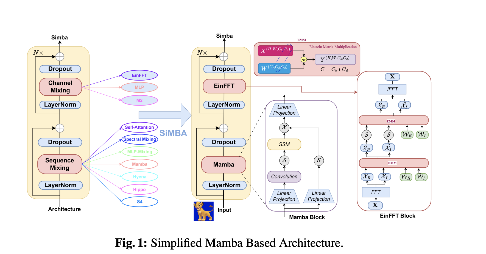

# Simba

A simpler Pytorch + Zeta Implementation of the paper: "SiMBA: Simplified Mamba-based Architecture for Vision and Multivariate Time series"


## install
`$ pip install simba-torch`

## usage
```python

import torch 
from simba_torch.main import Simba

# Forward pass with images
img = torch.randn(1, 3, 224, 224)

# Create model
model = Simba(
    dim = 4,                # Dimension of the transformer
    dropout = 0.1,          # Dropout rate for regularization
    d_state=64,             # Dimension of the transformer state
    d_conv=64,              # Dimension of the convolutional layers
    num_classes=64,         # Number of output classes
    depth=8,                # Number of transformer layers
    patch_size=16,          # Size of the image patches
    image_size=224,         # Size of the input image
    channels=3,             # Number of input channels
    # use_pos_emb=True # If you want
)

# Forward pass
out = model(img)
print(out.shape)

```


# License
MIT
